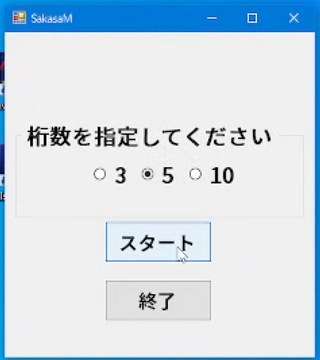
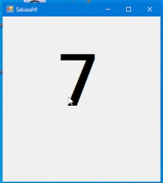
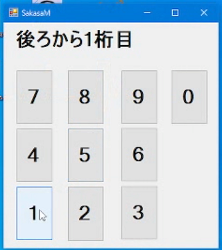
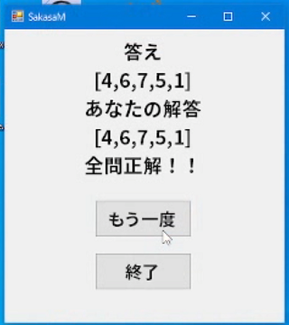

# SakasaM

## プレイ動画

https://user-images.githubusercontent.com/74619382/221636112-1fe34f2b-fd26-4ef0-9de9-25caf8f5da5e.mp4

## SakasaMの概要

知能テストの課題の一つである「逆唱」を再現したアプリです.
「逆唱」とは, 検査者が口頭で提示する数系列を, 提示の逆順で復唱する課題のことです.  

## 使用言語及びフレームワーク

- C#
- .NET Framework 4.8

## システム要件

- Windows 7 以上
- .NET Framework 4.8 以上

## インストール及び起動方法

1. [Releases](https://google.com) からダウンロードした SakasaM_(バージョン).zip を展開してください.

2. フォルダ内にある SakasaM.exe をダブルクリックして起動してください.

> **Note**
> ランタイムエラーで起動しなかった場合は, [.NET Framework のダウンロード](https://dotnet.microsoft.com/ja-jp/download/dotnet-framework)から .NET Framework 4.8以上のランタイムをダウンロード及びインストールしてください.

## 遊び方

1. SakasaM.exe をダブルクリックすると, 最初にスタート画面が表示されます.  
  桁数を選択することで, 提示される数系列の数を指定できます.  
  

2. スタートボタンを押すと出題画面が表示され, 1桁ずつ数系列が提示されます.  
  順番通りに覚えていきましょう.  
  

3. 指定した桁数分の数系列が提示されると, 解答画面が表示されます.  
  ここで, 先ほど覚えた数系列を**逆順に**1桁ずつ答えていきます.  
  

4. 解答画面で全問正解、もしくは間違えるとその時点で結果画面が表示されます。  
  「もう一度」をクリックするとスタート画面に戻り, 「終了」をクリックするとアプリが閉じます.  

## 追加予定の機能

- 数字読み上げ音声の追加
- 成績の保存・閲覧
